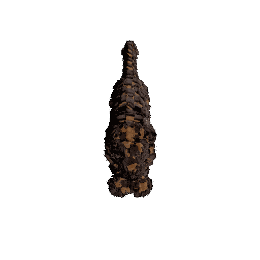
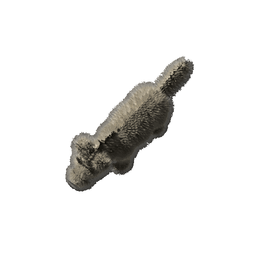
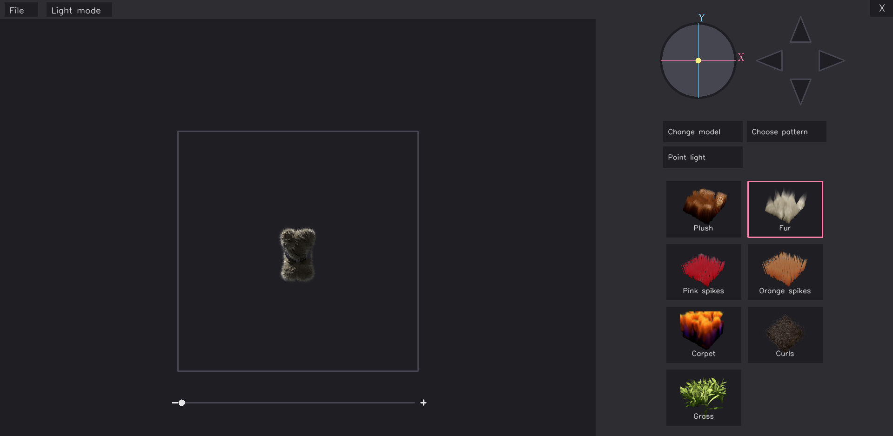

# Hybrid Representation for 3D Animal Model

This repository contains the implementation and experiments a bachelor thesis.

The work builds upon and extends **NeRF-Tex** and related 3D modeling approaches, focusing on hybrid representations for detailed 3D animal reconstruction.

<div style="display:flex; gap:10px;">


</div>

---

## Overview

This thesis explores a hybrid 3D representation method combining:
- ->Neural Radiance Fields (NeRF)
- ->Structured animal body priors (e.g. SMAL model)

The goal is to improve realism, controllability and generalization of 3D animal reconstruction.

---

## The Core Foundation 

This project builds upon:

- ->NeRF-Tex
- ->The Skinned Multi-Animal Linear Model

---

## Setup

Please refer to the original repository of [NeRF-Tex](https://github.com/hbaatz/nerf-tex) for environment setup and foundational implementations. 
Additional dependencies include:
```
conda install numpy tk
pip install opencv-python
```

---

## Interactive Renderer

- We develop a simple application that allows the user to creatively explore the NeRF-Tex texture representation applied to animal models.
- To start the user interface for the interactive rendering:
```
python interactive_renderer.py
```



---

## Notes

- -> Only the essential checkpoints and code are included, repository excludes large datasets.
Should you have a question regarding any details or want the files, feel free to contact me via [e-mail](lucinkakoprivnanska@gmail.com).

---

## Acknowledgements

All credit goes to the original authors of the base methods,
- -> [NeRF-Tex](https://hbaatz.github.io/nerf-tex/)
- -> [The SMAL Model](https://smal.is.tue.mpg.de/) 


